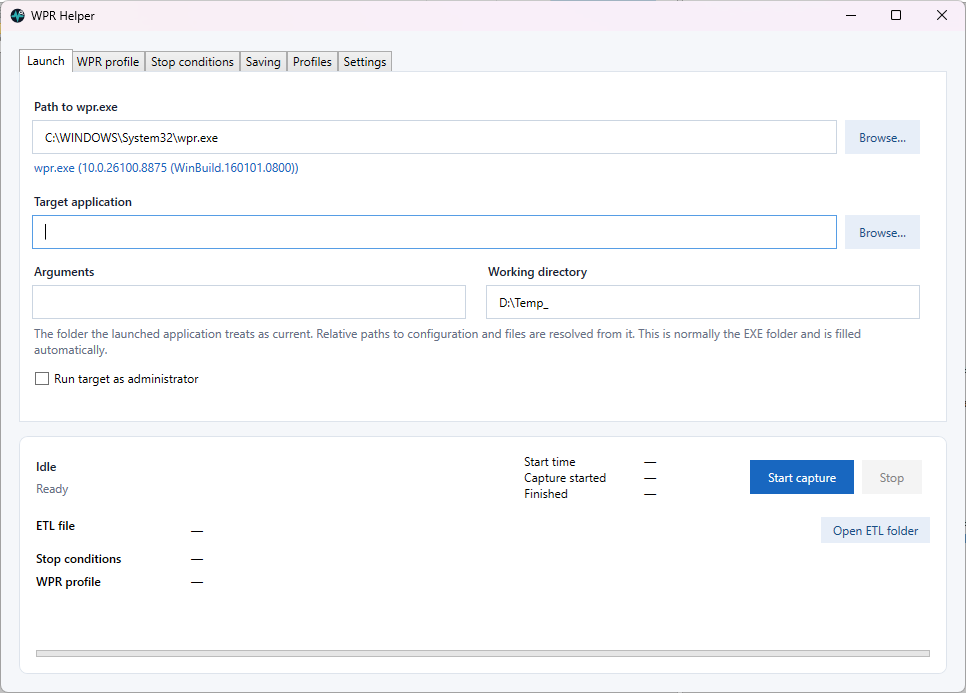

# WPR Helper

English · [Русский](README_RU.md)



WPR Helper is a portable Windows application for focused Windows Performance Recorder traces. It starts WPR immediately before the selected application, stops the recording at the right moment, and saves a ready-to-analyze `.etl` file.

Instead of manually coordinating commands and the target application, WPR Helper keeps the whole capture lifecycle in one window:

```text
wpr -start CPU -filemode
<launch the selected application>
wpr -stop Application.etl
```

## Why use it

- start the trace before the target application so early activity is not missed;
- combine several built-in profiles, such as `CPU`, `DiskIO`, `FileIO`, `Registry`, and `Network`;
- use custom `.wprp` profiles alongside built-in profiles;
- stop manually, after the target exits, after a delay, or at a maximum duration;
- save ETL files locally or to a UNC path, with an optional second copy;
- see the exact `wpr.exe` command applied to the current capture;

## Requirements

- Windows 10 or Windows 11 x64;
- `wpr.exe` from Windows or the Windows Performance Toolkit;
- administrator approval when the recording worker starts.

The release package is self-contained and does not require a separate .NET installation. WPR itself is not bundled.

## Quick start

1. Run `WprHelper.exe`.
2. Select the target application and set its arguments if needed.
3. Open **WPR profile** and select one or several profiles. `CPU` with `-filemode` is a practical default.
4. Choose where to save the ETL file.
5. Click **Start capture** and approve elevation.
6. Close the target application or click **Stop**.

WPR may spend some time merging its buffers. WPR Helper waits for `wpr -stop` to finish before showing the final ETL path and enabling **Open ETL folder**.

## WPR profiles

Built-in profiles can be combined in one capture. For example, selecting `CPU`, `DiskIO`, and `FileIO` produces a start command equivalent to:

```text
wpr -start CPU -start DiskIO -start FileIO -filemode
```

Custom profiles use the `path!profile_name` syntax supported by WPR. The interface shows a short description for known profiles and the full command line that will be executed.

## License

Distributed under the [MIT License](LICENSE).

## Download

[](https://github.com/numbereleven-a/WprHelper/releases/tag/v1.0)
[](https://github.com/numbereleven-a/WprHelper/releases)

Download the latest portable build from [GitHub Releases](https://github.com/numbereleven-a/WprHelper/releases).
